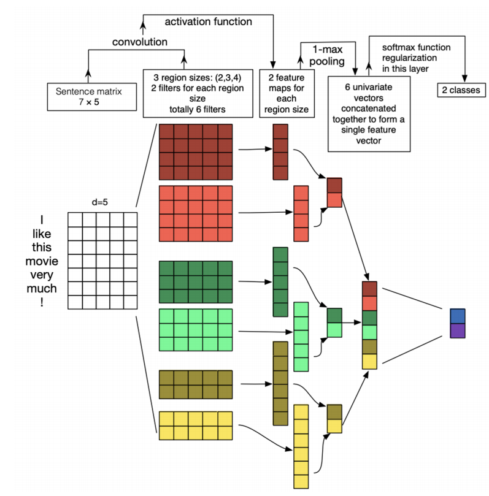

# 🇻🇳 Vietnamese Sentiment Analysis with TextCNN

A **sentiment analysis** using **PyTorch, TorchText, and Streamlit**.  
It uses a **TextCNN** model trained on the **NTC-SCV** dataset to classify Vietnamese text as **positive** or **negative**.

## Features
- Sentiment classification (**Positive / Negative**) for **Vietnamese text**.
- **Teencode normalization** (e.g., "ko" → "không").
- **Emoji preprocessing** and **URL removal**.
- **Fast and lightweight** inference using a pre-trained **TextCNN** model.
- **Interactive UI** with **Streamlit**.

---

## Model Architecture
The **TextCNN** model consists of:
- **Embedding Layer**: Converts words into dense vectors.
- **1D Convolutional Layers**: Extracts important features from text.
- **Max Pooling**: Reduces dimensionality and captures the most significant features.
- **Fully Connected Layer**: Outputs the final sentiment classification.
---
## Text Preprocessing
I processes Vietnamese text using `pyvi` for tokenization. You should consider using the `underthesea` library for more effective Vietnamese text processing. However, for some reason, I couldn't install it on my machine, so I used `pyvi` as an alternative. If you manage to install `underthesea`, try changing the tokenizer to compare the results. You can also increase the size of vocab, I just set it in my code just 1000 because of my lack of device.

## Result
My model achieved a `test accuracy: 0.8897` and `test loss: 0.2777` with only `20 epochs` and `batch_size = 128`.

Although it performs well on the test dataset, when testing the model through Streamlit after deployment, it seems to not work as effectively.