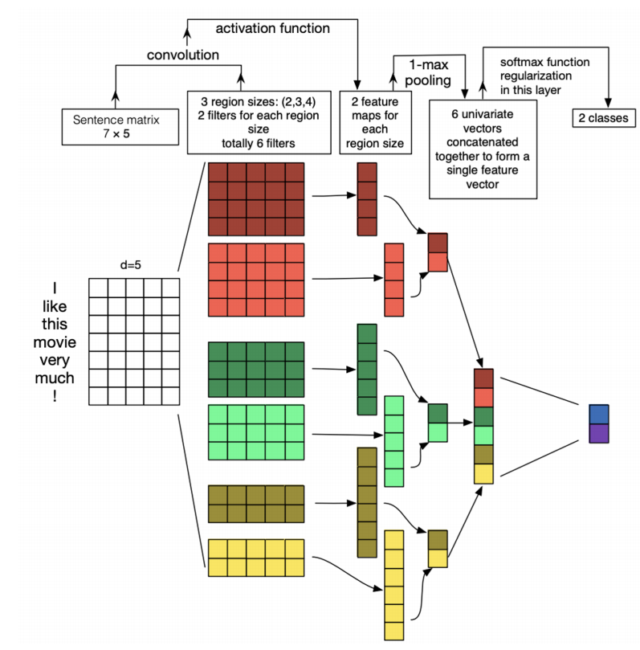
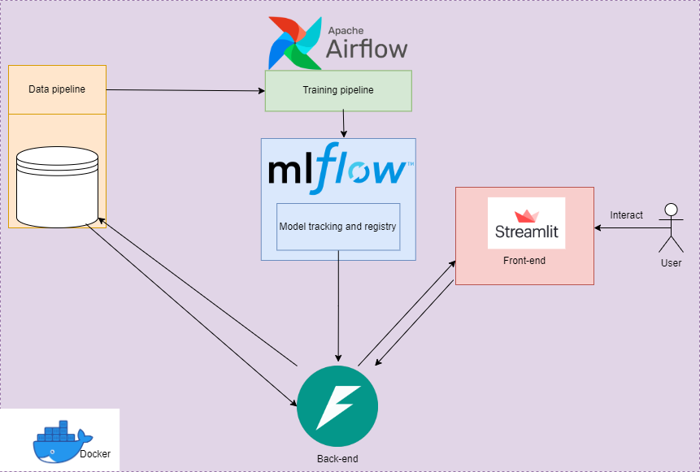

# 🇻🇳 Vietnamese Sentiment Analysis System

A comprehensive **sentiment analysis** system using ** PyTorch,  TorchText,  FastAPI,  Streamlit,  MLflow, and  Airflow**. 
The system uses a **TextCNN** model trained on the **NTC-SCV** dataset to classify Vietnamese text as **positive** or **negative**.



## 🌟 Features

- **Sentiment Classification**: Analyze Vietnamese text as positive or negative
- **Text Processing**: Teencode normalization, emoji handling, URL removal
- **Interactive UI**: Streamlit frontend for user interaction and feedback
- **API Backend**: FastAPI service for model inference and data handling
- **MLOps Pipeline**: 
  - **MLflow** for experiment tracking and model registry
  - **Airflow** for scheduling regular model retraining
- **Containerization**: Docker for easy deployment and environment consistency
- **Feedback Loop**: User feedback collection to improve model performance

---

## 🏗️ System Architecture



The system consists of several interconnected components:

1. **Frontend (Streamlit)**
   - Interactive web interface for text input
   - Visualization of sentiment analysis results
   - Feedback collection mechanism

2. **Backend (FastAPI)**
   - RESTful API endpoints for sentiment prediction
   - Feedback data collection and storage
   - Model serving and integration

3. **Model Training (PyTorch)**
   - TextCNN architecture implementation
   - TorchText for vocabulary building and text processing
   - Trained on NTC-SCV Vietnamese sentiment dataset

4. **MLOps Pipeline**
   - **MLflow** tracks experiments, parameters, and metrics
   - **Airflow** orchestrates regular model retraining
   - Automated model evaluation and deployment

5. **Containerization (Docker)**
   - Individual services containerized
   - Docker Compose for multi-container management
   - Consistent environments across development and production

---

## 🧠 Model Architecture

The **TextCNN** model consists of:

- **Embedding Layer**: Converts Vietnamese words into dense vectors
- **Multiple Convolutional Layers**: With different kernel sizes (2, 3, 4) to capture various n-gram features
- **Max Pooling**: Extracts the most important features from each convolutional output
- **Fully Connected Layer**: Maps extracted features to sentiment classification

Current performance metrics:
- Test Accuracy: **88.97%**
- Test Loss: **0.2777**

---

## 🔄 Workflow

### Training Pipeline

1. **Data Extraction**: Load raw data from NTC-SCV dataset
2. **Preprocessing**: 
   - Language filtering (Vietnamese only)
   - Teencode normalization
   - URL and HTML removal
   - Emoji handling
3. **Vocabulary Building**: Create word vocabulary using TorchText
4. **Model Training**: Train TextCNN model with PyTorch
5. **Evaluation**: Assess model on validation and test sets
6. **Deployment**: Register and deploy successful models via MLflow

### Inference Pipeline

1. **User Input**: Text submitted via Streamlit UI
2. **API Processing**: FastAPI endpoint receives and preprocesses text
3. **Model Inference**: Processed text fed to deployed model
4. **Result Visualization**: Sentiment predictions displayed in UI
5. **Feedback Collection**: User can provide feedback on prediction accuracy

---

## 🚀 Airflow Pipeline

The automated training pipeline is orchestrated by Apache Airflow, running on a weekly schedule:

```
📦 sentiment_analysis_training DAG
│
├── 📥 extract_data
│   └── Fetches raw data from NTC-SCV dataset
│
├── 🔄 transform_data
│   └── Filters non-Vietnamese content and preprocesses text
│
├── 🧠 train
│   └── Builds vocabulary and trains TextCNN model
│
├── 📊 evaluate
│   └── Tests model on hold-out data and logs metrics
│
└── 🚀 deploy_model
    └── Promotes model to production if metrics improve
```

The DAG runs weekly to incorporate new data and feedback, ensuring the model stays current with evolving language patterns. The pipeline automatically logs all experiments to MLflow, enabling complete tracking of model performance over time.

Key benefits:
- ⏱️ **Automated Scheduling**: Regular weekly retraining
- 🔍 **Data Validation**: Ensures quality input data
- 📈 **Performance Tracking**: Monitors metrics across versions
- 🛡️ **Deployment Safeguards**: Only deploys if performance improves
- 📝 **Comprehensive Logging**: Full experiment tracking with MLflow

---

## 🛠️ Technologies

- **Backend**: 
  -  FastAPI
  -  PyTorch
  -  TorchText
  - Pyvi (Vietnamese tokenization)
  
- **Frontend**: 
  -  Streamlit
  
- **MLOps**: 
  -  MLflow (experiment tracking, model registry)
  -  Airflow (pipeline scheduling)
  
- **Infrastructure**: 
  -  Docker
  - Docker Compose
  
- **Data Processing**:
  -  Pandas
  -  NumPy
  - Emoji
  - Langid (language detection)

---

## 🚀 Setup and Installation

### Prerequisites

- Docker and Docker Compose
- Git

### Quick Start

1. **Clone the repository**:
   ```bash
   git clone https://github.com/yourusername/vietnamese-sentiment-analysis.git
   cd vietnamese-sentiment-analysis
   ```

2. **Start the services**:
   ```bash
   docker-compose up -d
   ```

3. **Access the components**:
   - Streamlit UI: http://localhost:8501
   - FastAPI Docs: http://localhost:8000/docs
   - MLflow UI: http://localhost:5000
   - Airflow UI: http://localhost:8080

---

## 🔧 Environment Setup

This project uses a virtual environment to manage dependencies. Instead of committing the full environment, follow these steps to recreate it:

### Setup with venv

```bash
# Create a virtual environment
python -m venv myenv

# Activate the environment
# On Windows
myenv\Scripts\activate
# On macOS/Linux
source myenv/bin/activate

# Install dependencies
pip install -r requirements.txt
```

### Setup with Docker (Recommended)

```bash
# Build the containers
docker-compose build

# Start services
docker-compose up -d
```

For detailed setup instructions, refer to the [Setup and Installation](#-setup-and-installation) section.

---

## 📂 Project Structure

```
sentiment-analysis-app/
├── airflow/                  # Airflow DAGs and configurations
├── app/
│   ├── backend/              # FastAPI service
│   └── frontend/             # Streamlit UI
├── config/                   # Configuration files
├── data/                     # Dataset storage
├── docker/                   # Docker configurations
├── mlflow_/                  # MLflow utilities
├── models/                   # Saved models
├── notebooks/                # Jupyter notebooks for exploration and development
├── src/                      # Core source code
│   ├── model/                # Model architecture
│   ├── preprocessing/        # Text preprocessing utilities
│   └── train/                # Training logic
├── tests/                    # Unit and integration tests
├── .dockerignore
├── .gitignore
├── docker-compose.yml        # Multi-container Docker configuration
├── README.md
└── requirements.txt          # Python dependencies
```

---

## 📝 Text Preprocessing

The system processes Vietnamese text using multiple steps:

1. **Tokenization**: Using `pyvi` for Vietnamese word segmentation 
2. **Teencode Normalization**: Maps informal Vietnamese (e.g., "ko" → "không")
3. **URL and HTML Removal**: Removes web links and HTML tags
4. **Emoji Handling**: Converts emojis to textual representations
5. **Language Detection**: Filters out non-Vietnamese content

Note: For improved Vietnamese text processing, consider using `underthesea` library instead of `pyvi` if available on your system.

---

## 🔍 Future Improvements

- Implement more advanced model architectures (BERT, PhoBERT)
- Add support for aspect-based sentiment analysis
- Integrate active learning from user feedback
- Expand language support to handle code-switching (Vietnamese-English)
- Enhance visualization with sentiment trend analysis

---

## 📊 Results

Current model metrics with 20 epochs and batch size of 128:
- Test Accuracy: **88.97%**
- Test Loss: **0.2777**

The model performs well on the test dataset, though real-world performance through the Streamlit interface may vary. User feedback is being collected to improve future versions.

---

## 🙏 Acknowledgements

- [NTC-SCV](https://github.com/congnghia0609/ntc-scv) for the Vietnamese sentiment dataset
- [PyTorch](https://pytorch.org/) and [TorchText](https://pytorch.org/text/) teams
- Vietnamese NLP community